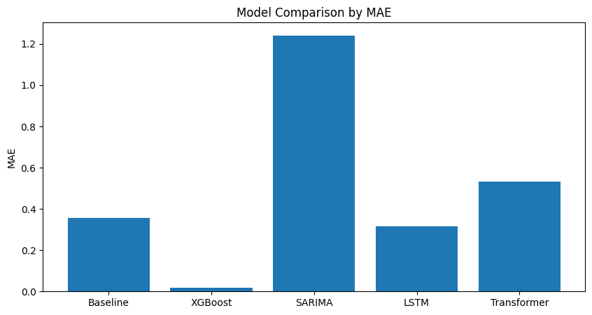
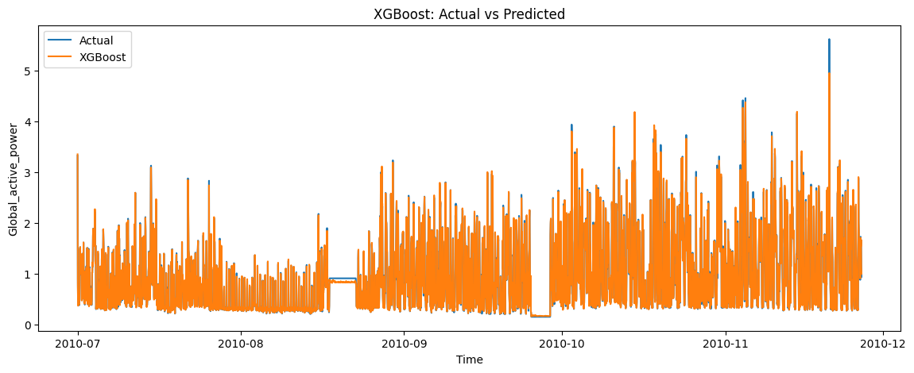
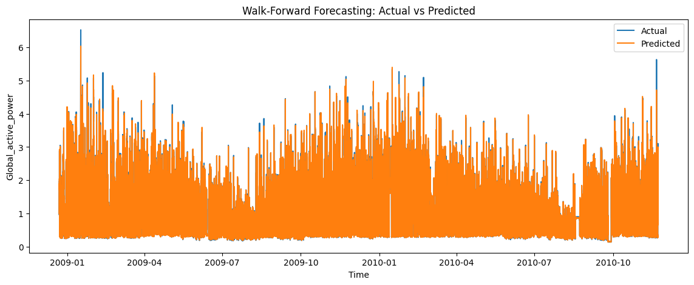
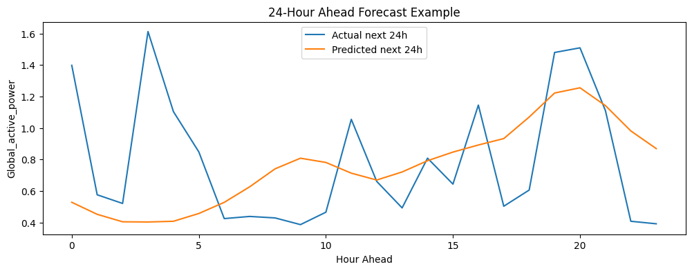
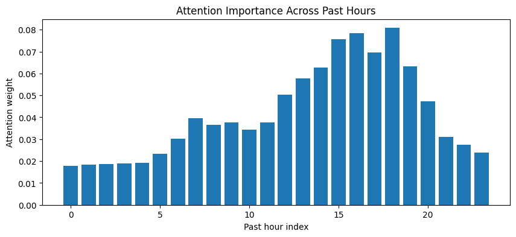
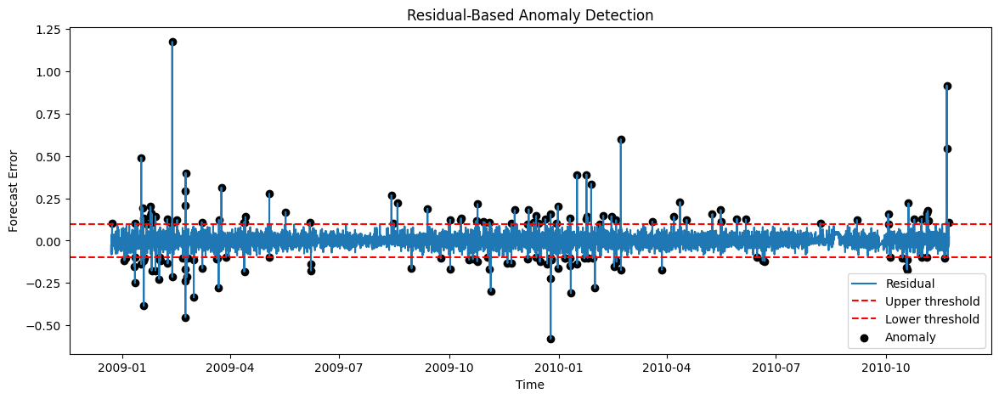
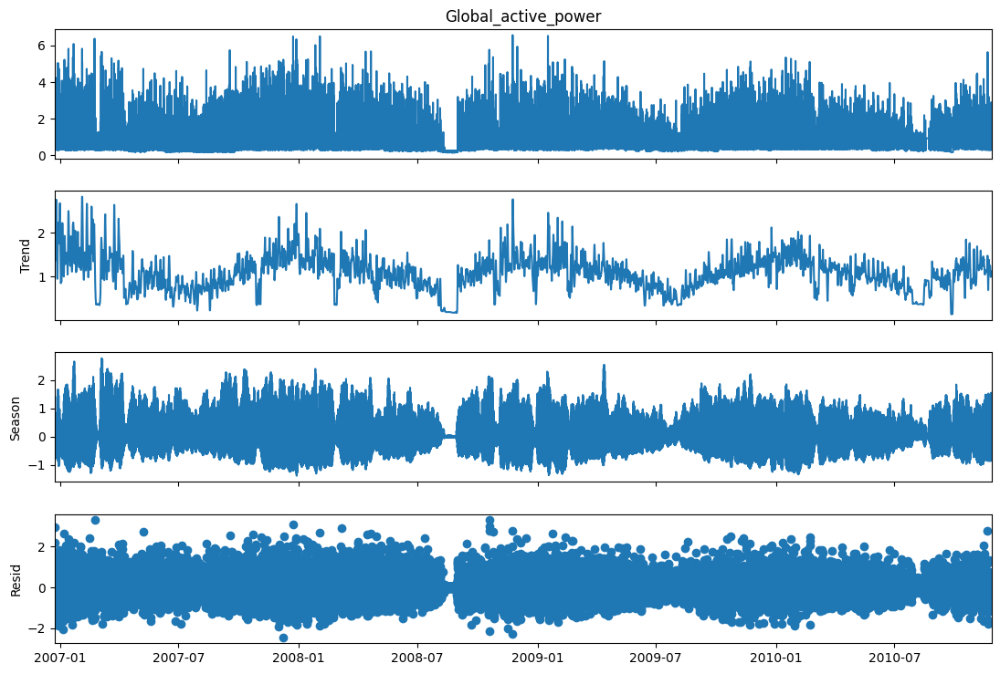

# Explainable Multi-Model Time Series Forecasting System for Household Energy Consumption

## Project Overview

This project develops an end-to-end explainable time series forecasting system for predicting household electricity consumption. Multiple forecasting approaches are compared, including statistical models, machine learning models, and deep learning architectures.

The project evaluates and compares:

* ARIMA
* SARIMA
* XGBoost
* LSTM
* Transformer

In addition to forecasting, the project includes:

* Walk-forward forecasting validation
* Multi-step forecasting (24-hour ahead prediction)
* Residual-based anomaly detection
* Transformer attention explainability
* Trend and seasonality analysis

---

## Dataset

This project uses the **Individual Household Electric Power Consumption Dataset** from the UCI Machine Learning Repository.

### Dataset Characteristics

* Time range: **2006–2010**
* Original frequency: **1-minute measurements**
* Resampled frequency: **Hourly**
* Approximately **35,000 hourly observations**

### Target Variable

`Global_active_power`

---

## Data Pipeline

### Data Processing

* Missing value handling
* Datetime indexing
* Hourly resampling
* Train / Validation / Test split

| Dataset    | Period             |
| ---------- | ------------------ |
| Train      | 2006-12 to 2009-12 |
| Validation | 2010-01 to 2010-06 |
| Test       | 2010-07 to 2010-11 |

### Feature Engineering

#### Lag Features

```text
lag_1
lag_24
lag_168
```

#### Rolling Statistics

```text
rolling_mean_24
rolling_std_24
```

#### Differencing

```text
diff_1
diff_24
```

#### Cyclical Encoding

```text
hour_sin
hour_cos
dow_sin
dow_cos
month_sin
month_cos
```

#### Regime Feature

```text
weekend
```

---

## Models Implemented

### Baseline Persistence Model

Predicts the next value using the previous observation.

Used as a benchmark for comparison.

---

### ARIMA / SARIMA

Classical statistical forecasting models that capture:

* Autoregressive behavior
* Moving average effects
* Seasonal patterns

---

### XGBoost

Gradient boosting model trained on engineered lag features.

Advantages:

* Strong performance on tabular time-series data
* Captures nonlinear relationships
* Robust feature handling

---

### LSTM

Long Short-Term Memory neural network designed for sequential data.

Configuration:

```text
LOOKBACK = 24
```

Input:

```text
Previous 24 hours
```

Output:

```text
Next hour prediction
```

---

### Transformer

Attention-based neural network architecture that learns relationships among past observations.

Advantages:

* Captures long-range dependencies
* Provides explainability through attention weights

---

## Model Evaluation

Evaluation metrics:

* MAE (Mean Absolute Error)
* RMSE (Root Mean Squared Error)

### Final Model Performance

| Model       | MAE       | RMSE      |
| ----------- | --------- | --------- |
| Baseline    | 0.358     | 0.562     |
| XGBoost     | **0.017** | **0.029** |
| SARIMA      | 1.241     | 1.399     |
| LSTM        | 0.315     | 0.455     |
| Transformer | 0.372     | 0.522     |

### Key Result

**XGBoost achieved the best forecasting performance on this dataset.**

---

## Walk-Forward Forecasting

To simulate real-world deployment, the XGBoost model was evaluated using rolling walk-forward forecasting.

### Configuration

```text
Training Window : 2 Years
Prediction Horizon : 1 Week (168 Hours)
```

### Average Performance

```text
MAE  ≈ 0.018
RMSE ≈ 0.029
```

The walk-forward results closely matched the original test performance, demonstrating strong temporal stability and generalization.

---

## Multi-Step Forecasting

A 24-hour ahead forecasting model was implemented using LSTM.

### Configuration

```text
LOOKBACK = 24
HORIZON  = 24
```

The model predicts the entire next day of electricity consumption from the previous 24 hours.

---

## Explainability

Transformer attention weights were extracted to identify which past observations most influenced predictions.

### Key Finding

The model assigned the highest attention to:

```text
24-hour lag
```

This indicates that daily periodicity is a dominant factor in household electricity consumption.

---

## Anomaly Detection

Anomaly detection was performed using forecast residuals.

### Process

1. Forecast consumption
2. Compute residuals

```text
Residual = Actual − Predicted
```

3. Detect outliers using residual thresholds

Detected anomalies correspond to unusual spikes or drops in electricity usage.

---

## Trend and Seasonality Analysis

Trend and seasonal behavior were analyzed using moving averages and seasonal decomposition.

### Findings

* Strong daily cycle
* Clear seasonal patterns
* Stable long-term consumption trend

---

## Key Visualizations

### Model Comparison



### XGBoost: Actual vs Predicted



### Walk-Forward Forecasting



### Multi-Step Forecasting (24-Hour Horizon)



### Transformer Attention Visualization



### Residual-Based Anomaly Detection



### Seasonal Decomposition



---

## Repository Structure

```text
Project126-energy-forecasting
│
├── README.md
├── LICENSE
├── requirements.txt
├── .gitignore
├── Project126_energy-forecasting.ipynb
│
└── results
    ├── figures
    │   ├── model_comparison_chart.png
    │   ├── xgboost_actual_vs_predicted.png
    │   ├── walk_forward_forecast.png
    │   ├── multistep_forecast_24h.png
    │   ├── attention_importance.png
    │   ├── anomaly_detection.png
    │   └── seasonal_decomposition.png
    │
    └── metrics
        └── model_comparison.csv
```

---

## How to Run

Install required packages:

```bash
pip install -r requirements.txt
```

Launch Jupyter Notebook:

```bash
jupyter notebook
```

Open:

```text
Project126_energy-forecasting.ipynb
```

---

## Key Takeaways

* Machine learning models outperformed classical statistical models on this dataset.
* XGBoost achieved the best overall forecasting accuracy.
* Walk-forward validation confirmed model stability over time.
* Transformer attention improved model interpretability.
* Residual analysis enabled anomaly detection.
* Multi-step forecasting demonstrated day-ahead prediction capability.

---

## Author

**Adugna Woldemedhin**

Data Engineering | Machine Learning | Time Series Forecasting | Artificial Intelligence


